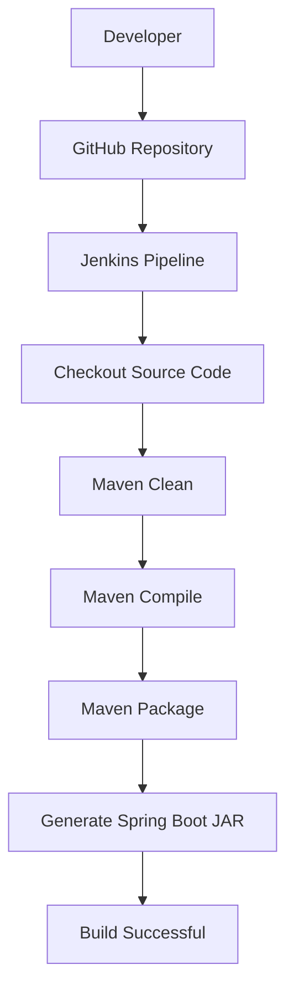

<div align="center">

# 🚀 Dockerized Jenkins Server

### Automating the Build Process of a Spring Boot Application using Jenkins running inside Docker

<p align="center">


</p>

---

### 📌 Project Overview

</div>

This project demonstrates how to **run Jenkins inside a Docker container** and automate the build process of a **Spring Boot Library Management System**.

It implements a **Continuous Integration (CI)** workflow where Jenkins automatically clones the project from GitHub, builds it using Maven, generates an executable Spring Boot JAR, and displays the build status.

---

# 🏗 Architecture

```text
                 Developer

                      │

                      ▼

              GitHub Repository

                      │

                      ▼

      Dockerized Jenkins Container

                      │

                      ▼

            Jenkins Pipeline

                      │

                      ▼

             Maven Build

                      │

                      ▼

      Spring Boot Application

                      │

                      ▼

         Executable JAR File
```

---

# 🎯 Project Objective

Traditional Java development requires:

- Manual compilation
- Manual Maven execution
- Manual deployment
- Environment setup on every machine

This project automates the complete build process using Jenkins.

```text
Developer

      │

      ▼

GitHub Push

      │

      ▼

Jenkins Pipeline

      │

      ▼

Maven Build

      │

      ▼

Spring Boot JAR

      │

      ▼

Build Success
```

---

# ⚙️ Technologies Used

| Technology | Purpose |
|------------|----------|
| 🐳 Docker | Containerization |
| 🤖 Jenkins | CI Server |
| ☕ Java 17 | Programming Language |
| 🍃 Spring Boot | Backend Framework |
| 📦 Maven | Build Automation |
| 🐙 Git | Version Control |
| 🌐 GitHub | Source Code Repository |
| 🐧 Ubuntu (WSL2) | Linux Environment |

---

# ✨ Features

- ✅ Jenkins running inside Docker
- ✅ Automated GitHub repository cloning
- ✅ Spring Boot build automation
- ✅ Maven dependency management
- ✅ Executable JAR generation
- ✅ Docker-based service management
- ✅ Continuous Integration using Jenkins Pipeline
- ✅ Persistent Jenkins data using Docker Volumes

---

# 📂 Project Structure

```text
LibraryManagementSystem

│

├── src/

│   ├── main/

│   ├── test/

│

├── Dockerfile

├── Jenkinsfile

├── pom.xml

├── docker-compose.yml

└── README.md
```

---

# 🚀 CI Pipeline Workflow



---

# 🔄 Jenkins Pipeline Stages

| Stage | Description |
|--------|-------------|
| Checkout | Clone project from GitHub |
| Build | Compile project using Maven |
| Package | Generate executable JAR |
| Post Actions | Display build status |

---

# 🐳 Docker Commands

### Build Jenkins Image

```bash
docker build -t my-jenkins .
```

### Run Jenkins Container

```bash
docker run -d \
--name jenkins-server \
-p 9090:8080 \
-p 50000:50000 \
-v C:\Jenkins\jenkins_home:/var/jenkins_home \
-v //var/run/docker.sock:/var/run/docker.sock \
my-jenkins
```

### View Running Containers

```bash
docker ps
```

### Stop Jenkins

```bash
docker stop jenkins-server
```

### Start Jenkins

```bash
docker start jenkins-server
```

### Restart Jenkins

```bash
docker restart jenkins-server
```

### View Logs

```bash
docker logs jenkins-server
```

---

# 💻 Running the Project

## Clone Repository

```bash
git clone https://github.com/rohitsalapu00/LibraryManagementSystem.git
```

Move into project

```bash
cd LibraryManagementSystem
```

Build

```bash
mvn clean package
```

Run

```bash
mvn spring-boot:run
```

Application

```
http://localhost:8081
```

Jenkins Dashboard

```
http://localhost:9090
```

---

# 📊 Build Results

✅ Repository successfully cloned

✅ Maven Build completed

✅ Spring Boot compiled

✅ Executable JAR generated

✅ Jenkins Pipeline passed

---
# 📸 Project Screenshots

## 🐳 Docker Desktop

Docker Desktop showing the custom Jenkins container running successfully.

<p align="center">
  
</p>

---

## 💻 Docker Container Status

Terminal output confirming that the Dockerized Jenkins container is running.

<p align="center">
  
</p>

---

## 🤖 Jenkins Dashboard

Jenkins dashboard displaying the configured pipeline and successful build history.

<p align="center">
  
</p>

---

## ✅ Successful Pipeline Execution

Console output showing the successful execution of the Jenkins pipeline.

<p align="center">
  
</p>

---
# 📈 DevOps Workflow

```text
Write Code

     │

     ▼

Git Commit

     │

     ▼

GitHub Push

     │

     ▼

Jenkins Trigger

     │

     ▼

Clone Repository

     │

     ▼

Compile Project

     │

     ▼

Package Application

     │

     ▼

Generate JAR

     │

     ▼

Build Successful
```

---

# ⚠ Challenges Faced

### WSL Installation

Configured WSL2 and Ubuntu to enable Docker Desktop.

### Docker Port Conflict

Resolved port conflict by exposing Jenkins on **9090**.

### Maven Configuration

Configured Maven inside Dockerized Jenkins.

### JDK Configuration

Configured Java 17 for Jenkins Global Tool Configuration.

### Dependency Download

The first Maven build downloaded all project dependencies. Later builds became significantly faster due to caching.

---

# 📚 Learning Outcomes

Through this project I learned:

- Docker Fundamentals
- Jenkins Installation
- Dockerized Jenkins
- WSL2 Configuration
- Maven Build Automation
- Spring Boot Build Process
- GitHub Integration
- Jenkins Pipeline
- Continuous Integration (CI)
- Docker Volumes
- Docker Networking
- Service Management using Docker

---

# 🎖 Project Outcomes

- ✅ Dockerized Jenkins Server
- ✅ Automated Build Execution
- ✅ Maven Integration
- ✅ Spring Boot Build Automation
- ✅ GitHub Integration
- ✅ CI Pipeline Successfully Implemented

---

# 🔮 Future Enhancements

- Docker Image Build Stage
- Docker Hub Integration
- SonarQube Code Analysis
- Automated Unit Testing
- Kubernetes Deployment
- AWS EC2 Deployment
- GitHub Webhooks
- Continuous Deployment (CD)

---

---

# 👨‍💻 Developed By

<div align="center">

| **Salapu Rohit** | **Salla Vamsi Ram** | **Malla Jyothi Prakash** |
|:----------------:|:-------------------:|:------------------------:|
| B.Tech CSE | B.Tech CSE | B.Tech CSE |
| Lovely Professional University | Lovely Professional University | Lovely Professional University |

</div>

---

# 🤝 Contributors

This project was collaboratively developed as part of a **DevOps learning initiative** to demonstrate how Jenkins can be containerized using Docker and integrated with a Spring Boot application for Continuous Integration (CI).

### Team Responsibilities

| Member | Contribution |
|---------|--------------|
| **Salapu Rohit** | Spring Boot Development, GitHub Repository Management |
| **Salla Vamsi Ram** | Library Management System Development & Testing |
| **Malla Jyothi Prakash** | Dockerized Jenkins Setup, WSL2 Configuration, Jenkins Pipeline, CI/CD Integration, Documentation |

---

# 📂 Project Repository

🔗 **GitHub Repository**

https://github.com/rohitsalapu00/LibraryManagementSystem

---

# 📊 Project Statistics

| Category | Details |
|----------|----------|
| Project Type | DevOps CI Pipeline |
| Backend Framework | Spring Boot |
| Programming Language | Java 17 |
| Build Tool | Maven |
| CI Tool | Jenkins |
| Container Platform | Docker |
| Version Control | Git & GitHub |
| Operating Environment | Ubuntu (WSL2) |
| Pipeline Type | Declarative Jenkins Pipeline |

---

# 📌 Key Achievements

- ✅ Successfully Dockerized Jenkins Server
- ✅ Configured Jenkins Pipeline
- ✅ Integrated GitHub Repository
- ✅ Automated Maven Build Process
- ✅ Generated Executable Spring Boot JAR
- ✅ Configured Java & Maven in Jenkins
- ✅ Implemented Continuous Integration Workflow
- ✅ Managed Jenkins Services using Docker

---

# ⭐ Support the Project

If you found this project helpful, please consider giving it a ⭐ on GitHub.

Your support encourages us to build more open-source projects and share our learning with the community.

---

# 📬 Connect With Us

### 👨‍💻 Salapu Rohit

GitHub: https://github.com/rohitsalapu00

---

### 👨‍💻 Malla Jyothi Prakash

GitHub: https://github.com/mallajyothiprakash

---

### 👨‍💻 Salla Vamsi Ram

GitHub: https://github.com/vamsiram24

---

<div align="center">

## ⭐ Thank You for Visiting Our Repository ⭐

**If you like this project, don't forget to leave a ⭐ on GitHub!**

Made with ❤️ by the Library Management System Team

</div>
