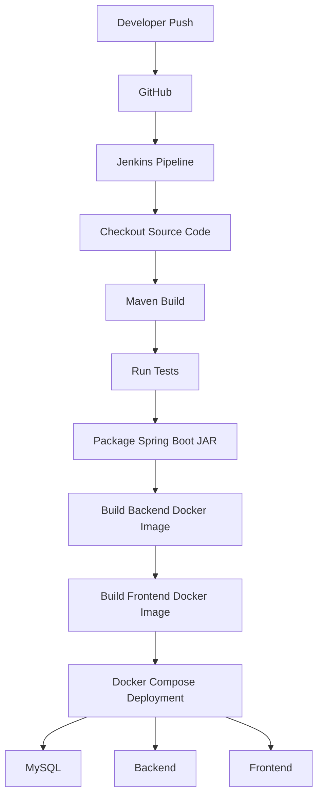
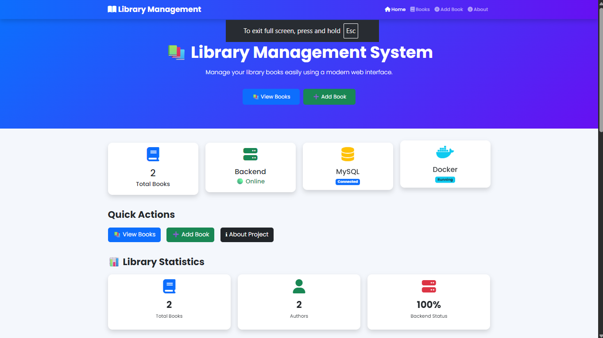
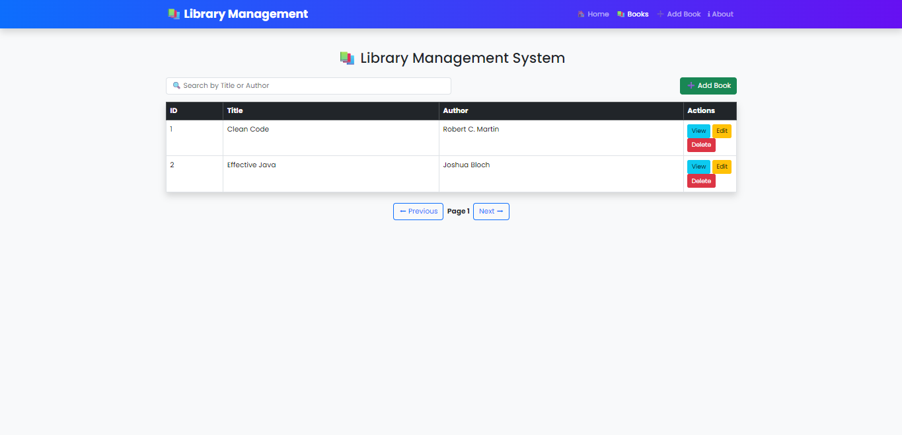
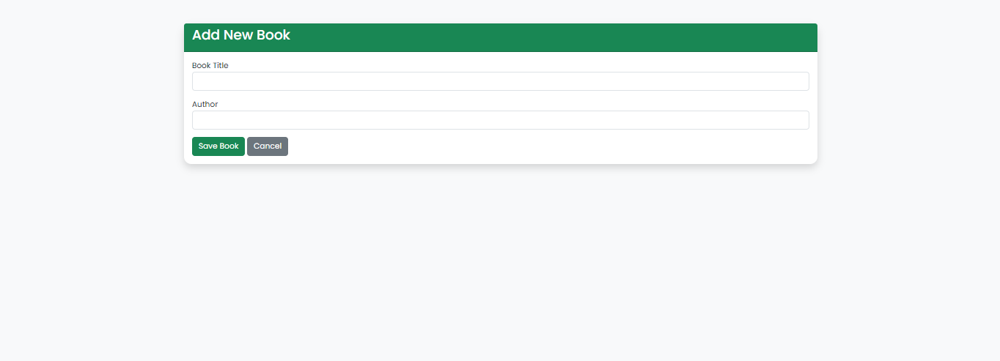
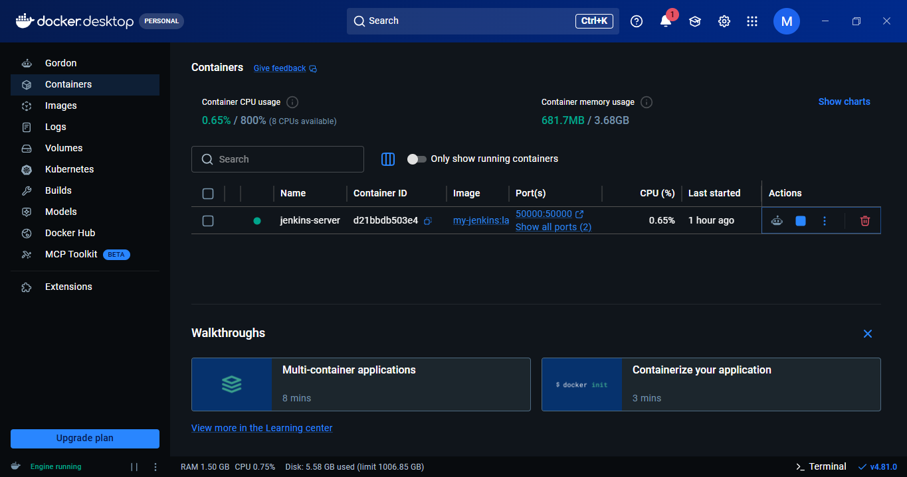
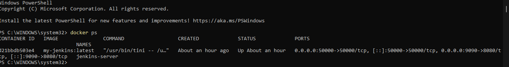
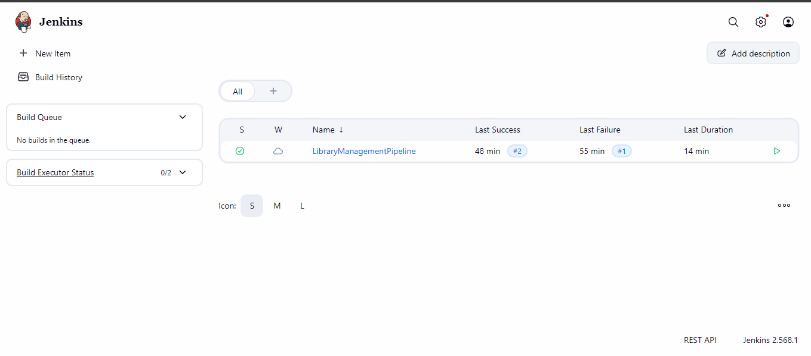
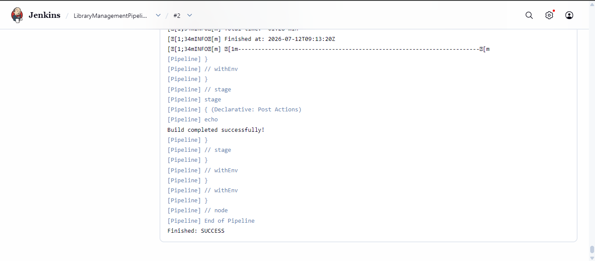

<div align="center">

# 🚀 Dockerized CI/CD Pipeline for Library Management System

### Automating Build, Docker Image Creation, and Deployment of a Spring Boot Library Management System using Jenkins running inside Docker.

<p align="center">


</p>

---

### 📌 Project Overview

</div>

This project demonstrates how to **run Jenkins inside a Docker container** and automate the build process of a **Spring Boot Library Management System**.

Jenkins automatically clones the project from GitHub, builds the Spring Boot application using Maven, runs tests, packages the application, builds Docker images for both the backend and frontend, and deploys the complete application using Docker Compose.

---

# 🏗 Architecture

```text
  Developer
      │
      ▼
GitHub Repository
      │
      ▼
Dockerized Jenkins
      │
      ▼
Checkout Source Code
      │
      ▼
  Maven Build
      │
      ▼
  Run Tests
      │
      ▼
  Package JAR
      │
      ▼
Build Backend Docker Image
      │
      ▼
Build Frontend Docker Image
      │
      ▼
Docker Compose Deployment
      │
      ▼
MySQL + Backend + Frontend
```

---

# 🎯 Project Objective

Traditional Java development requires:

- Manual compilation
- Manual Maven execution
- Manual deployment
- Environment setup on every machine

This project automates the complete build process using Jenkins.

```text
  Developer

      │

      ▼

  GitHub Push

      │

      ▼

Jenkins Pipeline

      │

      ▼

  Maven Build

      │

      ▼

Spring Boot JAR

      │

      ▼

Build Success
```

---

# ⚙️ Technologies Used

| Technology | Purpose |
|------------|----------|
| 🐳 Docker | Containerization |
| 🤖 Jenkins | CI Server |
| ☕ Java 17 | Programming Language |
| 🍃 Spring Boot | Backend Framework |
| 📦 Maven | Build Automation |
| 🐙 Git | Version Control |
| 🌐 GitHub | Source Code Repository |
| 🐧 Ubuntu (WSL2) | Linux Environment |

---

# ✨ Features

- ✅ Automated Spring Boot build using Maven
- ✅ Executable Spring Boot JAR generation
- ✅ Backend Docker image creation
- ✅ Frontend Docker image creation
- ✅ Docker Compose deployment
- ✅ Fully automated CI/CD pipeline using Jenkins
- ✅ GitHub integration
- ✅ Dockerized Jenkins server
- ✅ Multi-container application deployment

---

# 📂 Project Structure

```text
LibraryManagementSystem

│

├── frontend/

│   ├── css/

│   ├── js/

│   ├── pages/

│   ├── Dockerfile

│

├── screenshots/

│

├── src/

├── Dockerfile

├── docker-compose.yml

├── Jenkinsfile

├── pom.xml

└── README.md
```

---

# 🚀 CI Pipeline Workflow



---

# 🔄 Jenkins Pipeline Stages

| Stage                       | Description                              |
| --------------------------- | ---------------------------------------- |
| Checkout SCM                | Clone the project from GitHub            |
| Build                       | Compile the Spring Boot application      |
| Test                        | Execute Maven tests                      |
| Package                     | Generate executable Spring Boot JAR      |
| Build Backend Docker Image  | Create Docker image for Spring Boot      |
| Build Frontend Docker Image | Create Docker image for Nginx frontend   |
| Deploy Application          | Deploy all services using Docker Compose |


---
# 🐳 Docker Images

The project builds the following Docker images:

| Image | Purpose |
|--------|----------|
| my-jenkins | Jenkins CI Server with Java, Maven, Git, Docker and Docker Compose |
| librarymanagementsystem-library-app | Spring Boot Backend |
| librarymanagementsystem-frontend | Frontend served using Nginx |
| mysql:8.4 | MySQL Database |
# 🐳 Docker Commands

# 📦 Running Containers

After successful deployment, the following containers are running:

| Container | Purpose |
|-----------|----------|
| jenkins-server | Jenkins CI Server |
| librarymanagementpipeline-mysql-1 | MySQL Database |
| librarymanagementpipeline-library-app-1 | Spring Boot Backend |
| librarymanagementpipeline-frontend-1 | Frontend Application |
### Build Jenkins Image

```bash
docker build -t my-jenkins .
```

### Run Jenkins Container

```bash
docker run -d \
--name jenkins-server \
-p 9090:8080 \
-p 50000:50000 \
-v C:\Jenkins\jenkins_home:/var/jenkins_home \
-v //var/run/docker.sock:/var/run/docker.sock \
my-jenkins
```

### View Running Containers

```bash
docker ps
```

### Stop Jenkins

```bash
docker stop jenkins-server
```

### Start Docker Images

```bash
docker compose up --build -d
```

### Stop Docker Images

```bash
docker compose down
```


### Start Jenkins

```bash
docker start jenkins-server
```

### Restart Jenkins

```bash
docker restart jenkins-server
```

### View Logs

```bash
docker logs jenkins-server
```

---

# 💻 Running the Project

## Clone Repository

```bash
git clone https://github.com/rohitsalapu00/LibraryManagementSystem.git
```

Move into project

```bash
cd LibraryManagementSystem
```

Build

```bash
mvn clean package
```

Run

```bash
mvn spring-boot:run
```

Application

```
http://localhost:8081
```

Jenkins Dashboard

```
http://localhost:9090
```

---

# 📊 Build Results

✅ GitHub Repository cloned

✅ Maven Build Successful

✅ Unit Tests Executed

✅ Spring Boot JAR Generated

✅ Backend Docker Image Created

✅ Frontend Docker Image Created

✅ Docker Compose Deployment Successful

✅ Jenkins Pipeline Completed

---
# 📸 Project Screenshots

## 🏠 Home Page

<p align="center">
  
</p>

---

## 📚 View Books

<p align="center">
  
</p>

---

## ➕ Add Book

<p align="center">
  
</p>

---
## 🐳 Docker Desktop

Docker Desktop showing the custom Jenkins container running successfully.

<p align="center">
  
</p>

---

## 💻 Docker Container Status

Terminal output confirming that the Dockerized Jenkins container is running.

<p align="center">
  
</p>

---

## 🤖 Jenkins Dashboard

Jenkins dashboard displaying the configured pipeline and successful build history.

<p align="center">
  
</p>

---

## ✅ Successful Pipeline Execution

Console output showing the successful execution of the Jenkins pipeline.

<p align="center">
  
</p>

---
# 🔄 Jenkins Pipeline

The project uses a Declarative Jenkins Pipeline.

Pipeline Stages:

1. Checkout Source Code
2. Maven Build
3. Unit Testing
4. Package Spring Boot Application
5. Build Backend Docker Image
6. Build Frontend Docker Image
7. Deploy using Docker Compose
# 📈 DevOps Workflow

```text
Write Code

     │

     ▼

Git Commit

     │

     ▼

GitHub Push

     │

     ▼

Jenkins Trigger

     │

     ▼

Checkout Repository

     │

     ▼

Maven Build

     │

     ▼

Execute Tests

     │

     ▼

Package Application

     │

     ▼

Build Backend Image

     │

     ▼

Build Frontend Image

     │

     ▼

Docker Compose Deploy

     │

     ▼

Running Application
```

---

# ⚠ Challenges Faced

### WSL Installation

Configured WSL2 and Ubuntu to enable Docker Desktop.

### Docker Port Conflict

Resolved port conflict by exposing Jenkins on **9090**.

### Maven Configuration

Configured Maven inside Dockerized Jenkins.

### JDK Configuration

Configured Java 17 for Jenkins Global Tool Configuration.

### Dependency Download

The first Maven build downloaded all project dependencies. Later builds became significantly faster due to caching.

---

# 📚 Learning Outcomes

Through this project I learned:

- Docker Compose
- Multi-container Deployment
- Docker Networking
- Docker Volumes
- Docker Image Creation
- Jenkins Declarative Pipelines
- CI/CD Workflow Automation


---

# 🎖 Project Outcomes

- ✅ Dockerized Jenkins Server
- ✅ Spring Boot Build Automation
- ✅ Backend Docker Image
- ✅ Frontend Docker Image
- ✅ Docker Compose Deployment
- ✅ Complete CI/CD Pipeline
- ✅ GitHub Integration
- ✅ Maven Integration

---

# 🔮 Future Enhancements

- SonarQube Integration
- Docker Hub Push
- GitHub Webhooks
- Automated Testing
- Kubernetes Deployment
- AWS EC2 Deployment
- Continuous Delivery (CD)
- Monitoring using Prometheus & Grafana

---

---

# 👨‍💻 Developed By

<div align="center">

| **Salapu Rohit** | **Salla Vamsi Ram** | **Malla Jyothi Prakash** |
|:----------------:|:-------------------:|:------------------------:|
| B.Tech CSE | B.Tech CSE | B.Tech CSE |
| Lovely Professional University | Lovely Professional University | Lovely Professional University |

</div>

---

# 🤝 Contributors

This project was collaboratively developed as part of a **DevOps learning initiative** to demonstrate how Jenkins can be containerized using Docker and integrated with a Spring Boot application for Continuous Integration (CI).

### Team Responsibilities

| Member | Contribution |
|---------|--------------|
| **Salapu Rohit** | Spring Boot Development, GitHub Repository Management |
| **Salla Vamsi Ram** | Library Management System Development & Testing |
| **Malla Jyothi Prakash** | Dockerized Jenkins Setup, WSL2 Configuration, Jenkins Pipeline, CI/CD Integration, Documentation |

---

# 📂 Project Repository

🔗 **GitHub Repository**

https://github.com/rohitsalapu00/LibraryManagementSystem

---

# 📊 Project Statistics

| Category           | Details                      |
| ------------------ | ---------------------------- |
| Project Type       | Full Stack DevOps Project    |
| Backend            | Spring Boot                  |
| Frontend           | HTML, CSS, JavaScript        |
| Database           | MySQL                        |
| CI Tool            | Jenkins                      |
| Container Platform | Docker                       |
| Deployment         | Docker Compose               |
| Build Tool         | Maven                        |
| Version Control    | Git & GitHub                 |
| Pipeline           | Declarative Jenkins Pipeline |


---

# 📌 Key Achievements

- ✅ Dockerized Jenkins Server
- ✅ Maven Build Automation
- ✅ Spring Boot Packaging
- ✅ Backend Docker Image Creation
- ✅ Frontend Docker Image Creation
- ✅ Docker Compose Deployment
- ✅ Complete Jenkins CI/CD Pipeline
- ✅ GitHub Integrationr

---

# ⭐ Support the Project

If you found this project helpful, please consider giving it a ⭐ on GitHub.

Your support encourages us to build more open-source projects and share our learning with the community.

---

# 📬 Connect With Us

### 👨‍💻 Salapu Rohit

GitHub: https://github.com/rohitsalapu00

---

### 👨‍💻 Malla Jyothi Prakash

GitHub: https://github.com/mallajyothiprakash

---

### 👨‍💻 Salla Vamsi Ram

GitHub: https://github.com/vamsiram24

---

<div align="center">

## ⭐ Thank You for Visiting Our Repository ⭐

**If you like this project, don't forget to leave a ⭐ on GitHub!**

Made with ❤️ by the Library Management System Team

</div>
