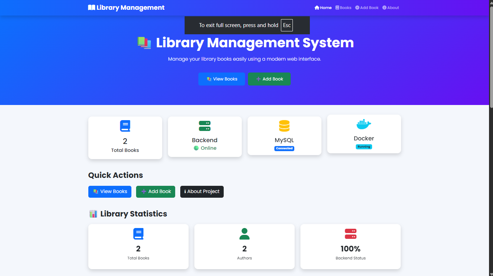
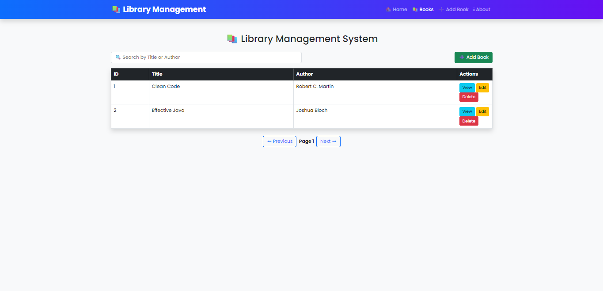
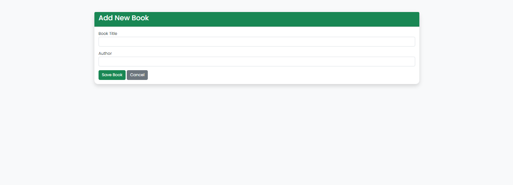
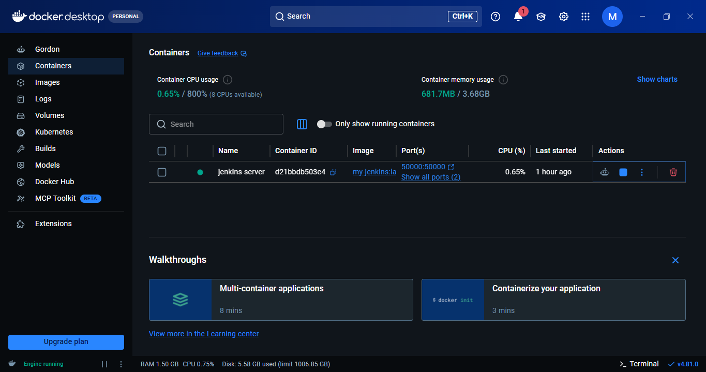
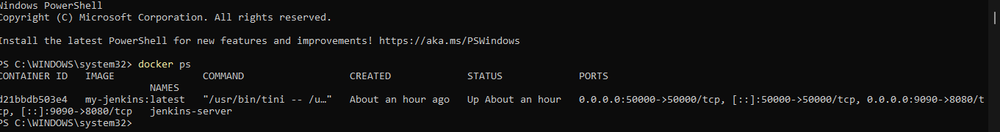
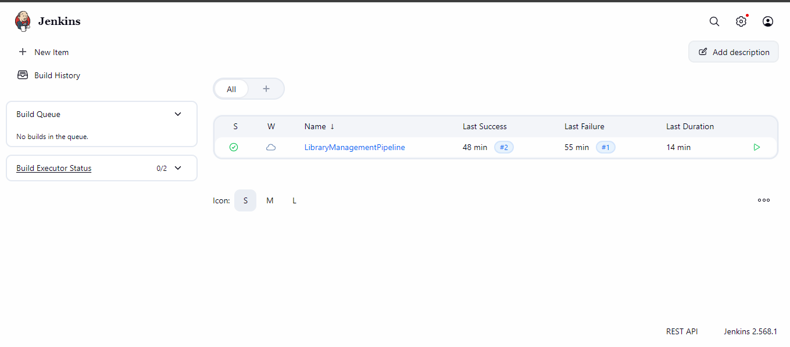
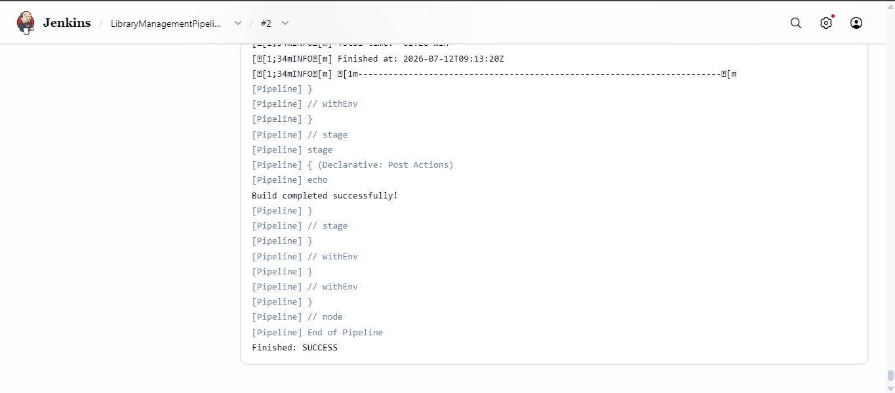

<div align="center">

# 🚀 Dockerized CI/CD Pipeline for Library Management System

### Automating Build, Testing, Docker Image Creation, Deployment, and Health Checks of a Spring Boot Library Management System using Jenkins.

<p align="center">


</p>

</div>

---

# 📌 Project Overview

This project demonstrates a complete DevOps-based CI/CD workflow for a full-stack Library Management System.

The backend is developed using Spring Boot, the frontend uses HTML, CSS, JavaScript and Bootstrap, and MySQL is used as the database.

Jenkins is used to automate the complete CI/CD pipeline:

- Checkout source code from GitHub
- Compile the Spring Boot application using Maven
- Run automated unit tests
- Package the Spring Boot application
- Build the backend Docker image
- Build the frontend Docker image
- Deploy the application using Docker Compose
- Perform backend and frontend health checks

The application runs as a multi-container system consisting of:

**MySQL + Spring Boot Backend + Nginx Frontend**

# 🏗 Architecture

````text
                    Developer
                        │
                        ▼
                 GitHub Repository
                        │
                        ▼
                 Jenkins Pipeline
                        │
                        ▼
                Checkout Source Code
                        │
                        ▼
                   Maven Build
                        │
                        ▼
                  Unit Testing
                        │
                        ▼
              Package Spring Boot JAR
                        │
                        ▼
             Build Backend Docker Image
                        │
                        ▼
             Build Frontend Docker Image
                        │
                        ▼
              Docker Compose Deployment
                        │
             ┌──────────┼──────────┐
             ▼          ▼          ▼
           MySQL     Backend    Frontend
                        │
                        ▼
                  Health Checks
                        │
                        ▼
                Pipeline SUCCESS

---

# 🎯 Project Objective

Traditional application development may involve:

- Manual compilation
- Manual testing
- Manual packaging
- Manual Docker image creation
- Manual deployment
- Manual environment configuration

This project automates these activities using Jenkins, Maven, Docker and Docker Compose.

The overall workflow is:

```text
Developer
    │
    ▼
Git Commit
    │
    ▼
GitHub Push
    │
    ▼
Jenkins Pipeline
    │
    ▼
Maven Build
    │
    ▼
Unit Tests
    │
    ▼
Package JAR
    │
    ▼
Docker Images
    │
    ▼
Docker Compose
    │
    ▼
Application Deployment
    │
    ▼
Health Checks

# ⚙️ Technologies Used

| Technology | Purpose |
| ---------------- | ------------------------------ |
| 🐳 Docker | Containerization |
| 🤖 Jenkins | CI/CD automation |
| ☕ Java 17 | Programming Language |
| 🍃 Spring Boot 3.5.4 | Backend Framework |
| 📦 Maven | Build Automation |
| 🐬 MySQL 8.4 | Database |
| 🌐 Nginx | Frontend Web Server |
| 🧪 JUnit | Unit Testing |
| 🎭 Mockito | Mocking for Unit Tests |
| 🐙 Git | Version Control |
| 🌐 GitHub | Source Code Repository |
| 🎨 Bootstrap 5 | Frontend UI |

# ✨ Features

## 📚 Library Management

- ✅ Add Books
- ✅ View Books
- ✅ Update Books
- ✅ Delete Books
- ✅ Search/View Books
- ✅ Issue Books
- ✅ Return Books
- ✅ Book issue date tracking
- ✅ Book due date tracking
- ✅ Book return date tracking

## 🛡 Validation and Error Handling

- ✅ Title validation
- ✅ Author validation
- ✅ Duplicate book prevention
- ✅ Book not found handling
- ✅ Global exception handling
- ✅ Invalid request handling

## 🧪 Automated Testing

- ✅ JUnit testing
- ✅ Mockito testing
- ✅ BookService unit tests
- ✅ 11 automated tests
- ✅ All 11 tests passing

## 🚀 DevOps

- ✅ Maven build automation
- ✅ Jenkins Declarative Pipeline
- ✅ Dockerized Jenkins
- ✅ Backend Docker image
- ✅ Frontend Docker image
- ✅ Docker Compose deployment
- ✅ Automated deployment
- ✅ Backend health check
- ✅ Frontend health check
- ✅ GitHub integration

# 📂 Project Structure

```text
LibraryManagementSystem
│
├── frontend/
│   ├── css/
│   ├── js/
│   ├── pages/
│   └── Dockerfile
│
├── screenshots/
│
├── src/
│   ├── main/
│   │   ├── java/
│   │   │   └── com/
│   │   │       └── library/
│   │   │           ├── config/
│   │   │           ├── controller/
│   │   │           ├── entity/
│   │   │           ├── exception/
│   │   │           ├── repository/
│   │   │           └── service/
│   │   │
│   │   └── resources/
│   │
│   └── test/
│       └── java/
│           └── com/
│               └── library/
│                   └── service/
│                       └── BookServiceTest.java
│
├── Dockerfile
├── docker-compose.yml
├── Jenkinsfile
├── pom.xml
└── README.md


---

# 🔄 CI/CD Pipeline Workflow

```mermaid
flowchart TD

A[Developer Push] --> B[GitHub]

B --> C[Jenkins Pipeline]

C --> D[Checkout Source Code]

D --> E[Maven Build]

E --> F[Run Unit Tests]

F --> G[Package Spring Boot JAR]

G --> H[Build Backend Docker Image]

H --> I[Build Frontend Docker Image]

I --> J[Docker Compose Deployment]

J --> K[MySQL]

J --> L[Spring Boot Backend]

J --> M[Nginx Frontend]

K --> N[Health Checks]

L --> N

M --> N

N --> O[Pipeline Success]


---

# 🔄 Jenkins Pipeline Stages

The Jenkins pipeline contains the following stages:

| Stage | Description |
| --------------------------- | --------------------------------------------- |
| Checkout SCM | Clone the project from GitHub |
| Build | Compile the Spring Boot application |
| Test | Execute automated unit tests |
| Package | Generate executable Spring Boot JAR |
| Build Backend Docker Image | Create Docker image for Spring Boot |
| Build Frontend Docker Image | Create Docker image for Nginx frontend |
| Deploy Application | Deploy services using Docker Compose |
| Health Check | Verify backend and frontend availability |

# 🧪 Automated Testing

The project contains unit tests for the `BookService`.

Testing is performed using:

- JUnit
- Mockito
- Maven Surefire

The latest successful test execution produced:

```text
Tests run: 11
Failures: 0
Errors: 0
Skipped: 0

Result: BUILD SUCCESS


---

# 🛡 Duplicate Book Prevention

Duplicate books were identified during database testing.

The project was updated to prevent duplicate books with the same:

```text
Title + Author


---

# ❤️ Deployment Health Checks

After deploying the application, Jenkins verifies that the application is actually accessible.

## Backend Health Check

Jenkins checks:

```bash
curl -f http://localhost:8081/books


---

# 🐳 Docker Architecture

The application consists of three primary services.

```text
                 Docker Compose
                       │
        ┌──────────────┼──────────────┐
        │              │              │
        ▼              ▼              ▼
      MySQL         Backend        Frontend
     Port 3306      Port 8081       Port 80
        │              │              │
        │         Spring Boot        │
        │              │             Nginx
        └──────────────┼──────────────┘
                       │
                    Network

# 🐳 Docker Images

| Image | Purpose |
| ----------------------------------- | -------------------------------- |
| `my-jenkins` | Custom Jenkins CI server |
| `librarymanagementsystem-library-app` | Spring Boot backend |
| `librarymanagementsystem-frontend` | Nginx frontend |
| `mysql:8.4` | MySQL database |

# 🐳 Docker Compose Commands

## Start Application

```bash
docker compose up --build -d
docker compose down
docker compose restart
docker ps

# 📦 Running Containers

After successful deployment, the application contains:

| Container | Purpose |
| --------------------------------------- | -------------------- |
| `librarymanagementpipeline-mysql-1` | MySQL Database |
| `librarymanagementpipeline-library-app-1` | Spring Boot Backend |
| `librarymanagementpipeline-frontend-1` | Frontend Application |

The containers expose:

| Service | Port |
| -------- | ---- |
| MySQL | 3306 |
| Spring Boot Backend | 8081 |
| Nginx Frontend | 80 |

# 🤖 Dockerized Jenkins

Jenkins is configured to automate the CI/CD process.

The custom Jenkins environment includes:

- Java
- Maven
- Git
- Docker
- Docker Compose

## Build Jenkins Image

```bash
docker build -t my-jenkins .

docker run -d \
--name jenkins-server \
-p 9090:8080 \
-p 50000:50000 \
-v /var/jenkins_home:/var/jenkins_home \
-v /var/run/docker.sock:/var/run/docker.sock \
my-jenkins

docker ps
docker stop jenkins-server
docker start jenkins-server
docker restart jenkins-server


---

# 💻 Running the Project

## Clone Repository

```bash
git clone https://github.com/rohitsalapu00/LibraryManagementSystem.git
cd LibraryManagementSystem
mvn clean package
mvn spring-boot:run


---

# 🌐 Application URLs

## Frontend

```text
http://localhost
http://localhost:8081/books
http://localhost:9090


---

# 🔌 REST API

The backend provides REST APIs for managing books.

Example:

```text
GET /books


---

# 📊 Database

The application uses:

```text
Database: MySQL
Version: 8.4
Database Name: librarydb

SELECT COUNT(*) FROM books;
SELECT title, author, COUNT(*) AS copies
FROM books
GROUP BY title, author
HAVING COUNT(*) > 1;


---

# 📊 Build Results

The latest successful Jenkins pipeline verifies:

```text
✅ GitHub Repository Checkout
✅ Maven Compilation
✅ Unit Tests
✅ 11 Tests Passed
✅ Spring Boot JAR Generated
✅ Backend Docker Image Created
✅ Frontend Docker Image Created
✅ Docker Compose Deployment
✅ MySQL Container Started
✅ Backend Container Started
✅ Frontend Container Started
✅ Backend Health Check Passed
✅ Frontend Health Check Passed
✅ Jenkins Pipeline Completed Successfully


---


# 📸 Project Screenshots

## 🏠 Home Page

<p align="center">
  
</p>

---

## 📚 View Books

<p align="center">
  
</p>

---

## ➕ Add Book

<p align="center">
  
</p>

---

## 🐳 Docker Desktop

Docker Desktop showing the project containers running successfully.

<p align="center">
  
</p>

---

## 💻 Docker Container Status

Terminal output confirming that the Docker containers are running.

<p align="center">
  
</p>

---

## 🤖 Jenkins Dashboard

Jenkins dashboard displaying the configured pipeline and successful build history.

<p align="center">
  
</p>

---

## ✅ Successful Pipeline Execution

Console output showing the successful execution of the Jenkins CI/CD pipeline.

<p align="center">
  
</p>

# 🔄 Jenkins Pipeline

The project uses a **Declarative Jenkins Pipeline**.

Pipeline stages:

```text
1. Checkout Source Code
        ↓
2. Maven Build
        ↓
3. Unit Testing
        ↓
4. Package Spring Boot Application
        ↓
5. Build Backend Docker Image
        ↓
6. Build Frontend Docker Image
        ↓
7. Deploy using Docker Compose
        ↓
8. Backend Health Check
        ↓
9. Frontend Health Check
        ↓
10. Pipeline Success


---

```markdown
# 📈 DevOps Workflow

```text
Write Code
     │
     ▼
Git Commit
     │
     ▼
GitHub Push
     │
     ▼
Jenkins Trigger
     │
     ▼
Checkout Repository
     │
     ▼
Maven Build
     │
     ▼
Execute Unit Tests
     │
     ▼
Package Application
     │
     ▼
Build Backend Image
     │
     ▼
Build Frontend Image
     │
     ▼
Docker Compose Deploy
     │
     ▼
Health Checks
     │
     ▼
Running Application


---

```markdown
# ⚠ Challenges Faced

## Jenkins PATH Configuration

Jenkins initially could not find Maven and Docker because Jenkins was running with a different environment PATH from the normal terminal.

This was resolved by configuring the required paths in the Jenkinsfile.

## Duplicate Book Records

Duplicate book records were identified during MySQL database testing.

The duplicate records were removed and duplicate prevention was implemented using:

```java
existsByTitleAndAuthor()


---

```markdown
# 📚 Learning Outcomes

Through this project, we learned:

- Docker
- Docker Compose
- Multi-container Deployment
- Docker Networking
- Docker Volumes
- Docker Image Creation
- Jenkins Declarative Pipelines
- CI/CD Workflow Automation
- Maven Build Automation
- JUnit Unit Testing
- Mockito
- REST API Development
- REST API Testing
- MySQL Database Management
- Application Health Checks
- Git and GitHub
- Nginx
- Spring Boot

# 🎖 Project Outcomes

The project successfully demonstrates:

- ✅ Dockerized Jenkins Server
- ✅ Maven Build Automation
- ✅ Spring Boot Packaging
- ✅ Automated Unit Testing
- ✅ 11 Passing Unit Tests
- ✅ Duplicate Book Prevention
- ✅ Backend Docker Image
- ✅ Frontend Docker Image
- ✅ MySQL Container
- ✅ Docker Compose Deployment
- ✅ Backend Health Check
- ✅ Frontend Health Check
- ✅ GitHub Integration
- ✅ Complete CI/CD Pipeline

# 🔮 Future Enhancements

The following improvements can be considered for future versions:

- SonarQube Integration
- Docker Hub Image Publishing
- GitHub Webhooks for automatic Jenkins triggering
- Automated API/Integration Testing
- Security Scanning
- Kubernetes Deployment
- AWS EC2 Deployment
- Production Cloud Deployment
- Prometheus Monitoring
- Grafana Dashboards
- Container Security Scanning

# 👨‍💻 Developed By

<div align="center">

| **Salapu Rohit** | **Salla Vamsi Ram** | **Malla Jyothi Prakash** |
| :----------------------------: | :----------------------------: | :----------------------------: |
| B.Tech CSE | B.Tech CSE | B.Tech CSE |
| Lovely Professional University | Lovely Professional University | Lovely Professional University |

</div>

# 🤝 Contributors

This project was collaboratively developed as part of a **DevOps learning initiative** to demonstrate how Jenkins can be containerized using Docker and integrated with a Spring Boot application for Continuous Integration and Continuous Deployment.

## Team Responsibilities

| Member | Contribution |
| ------------------------ | ------------------------------------------------------------------------------------------------ |
| **Salapu Rohit** | Spring Boot Development, GitHub Repository Management |
| **Salla Vamsi Ram** | Library Management System Development & Testing |
| **Malla Jyothi Prakash** | Dockerized Jenkins Setup, Jenkins Pipeline, CI/CD Integration, Docker Configuration, Testing, Documentation |

# 📂 Project Repository

GitHub Repository:

https://github.com/rohitsalapu00/LibraryManagementSystem

# 📊 Project Statistics

| Category | Details |
| ---------------- | ------------------------------ |
| Project Type | Full Stack DevOps Project |
| Backend | Spring Boot 3.5.4 |
| Programming Language | Java 17 |
| Frontend | HTML, CSS, JavaScript |
| UI Framework | Bootstrap 5 |
| Database | MySQL 8.4 |
| CI/CD Tool | Jenkins |
| Container Platform | Docker |
| Web Server | Nginx |
| Deployment | Docker Compose |
| Build Tool | Maven |
| Testing | JUnit + Mockito |
| Version Control | Git & GitHub |
| Pipeline | Declarative Jenkins Pipeline |
| Automated Tests | 11 |
| Test Result | 11 Passed |

# 📌 Key Achievements

- ✅ Dockerized Jenkins Server
- ✅ Maven Build Automation
- ✅ Spring Boot Packaging
- ✅ Automated Unit Testing
- ✅ 11 Passing Unit Tests
- ✅ Duplicate Book Prevention
- ✅ Backend Docker Image Creation
- ✅ Frontend Docker Image Creation
- ✅ MySQL Containerization
- ✅ Docker Compose Deployment
- ✅ Backend Health Check
- ✅ Frontend Health Check
- ✅ Complete Jenkins CI/CD Pipeline
- ✅ GitHub Integration

# ⭐ Support the Project

If you found this project helpful, please consider giving it a ⭐ on GitHub.

Your support encourages us to build more projects and continue learning DevOps and cloud technologies.

# 📬 Connect With Us

### 👨‍💻 Salapu Rohit

GitHub:

https://github.com/rohitsalapu00

---

### 👨‍💻 Malla Jyothi Prakash

GitHub:

https://github.com/mallajyothiprakash

---

### 👨‍💻 Salla Vamsi Ram

GitHub:

https://github.com/vamsiram24

---

<div align="center">

## ⭐ Thank You for Visiting Our Repository ⭐

**If you like this project, don't forget to leave a ⭐ on GitHub!**

Made with ❤️ by the Library Management System Team

</div>
````
